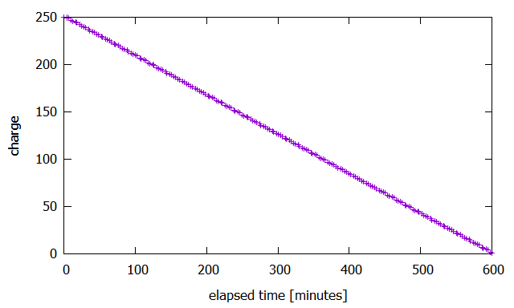

# IoT Course at AGH University of Science and Technology in Krakow
## Extend the IoT-Sim-Edge Simulator with data from PVGIS

###### Authors
<li> Bochnia Konrad
<li> Gargas Jan
<li> Siwek Patryk
<li> Węgrzyn Michał

### Project's goals
The main goal was to simulate photovoltaic battery behaviour in certain geographical coordinates. 
We want to check if photovoltaic installation is profitable and how many batteries we need to have in order to supply enough energy.

### Solution description
#### Main Idea
The existing [IoT-Sim-Edge Simulator](https://github.com/DNJha/IoTSim-Edge "IoT-Sim-Edge Simulator Homepage") was extended to gather appropriate data from the [PVGIS](https://ec.europa.eu/jrc/en/pvgis "PVGIS Homepage"). 
Data is kept in added classes (*org.edge.project.data_models*) and used to run simulator with the new configuration.
 
#### Configuration
```java
public class Solar {
    private double lat;
    private double lon;
    private double peakPower;
    private double loss;
...
}

...

public class Configuration {
    private Solar solar;
    private LocalDateTime startDate;
    private LocalDateTime endDate;
...
}
```

To run simulation we need to set the geographic coordinates (lat/lon) for the solar battery. We also need to set peakPower and lossPerTick in battery. 
When the battery's configuration is done, the next step is to decide about startDate and endDate. 


#### Data Gathering
Method *buildURL* in *DayHTTPManager* is building, based on the configuration, url for query. Next we transform results into java objects and run simulation.

```java
public class DayHTTPManager {
    ...
    private static String buildUrl(String lat, String lon, double peakPower, double loss, LocalDateTime startDate, LocalDateTime endDate) {
        StringBuilder strBuilder = new StringBuilder("https://re.jrc.ec.europa.eu/api/seriescalc?")
                .append("lat=")
                .append(lat)
                .append("&lon=")
                .append(lon)
                .append("&startyear=")
                .append(startDate.getYear())
                .append("&endyear=")
                .append(endDate.getYear())
                .append("&peakpower=")
                .append(peakPower)
                .append("&loss=")
                .append(loss)
                .append("&pvcalculation=1&pvtechchoice=crystSi&optimalangles=1&outputformat=json");
        return strBuilder.toString();
    }
    ...
}
```

#### Running Simulation

#### IoTDevice

We have added two additional fields to `IoTDevice` class.
One of them is an instance of `Configuration` class that is used to fetch current power gathered by the 
solar panels. The other one is an instance of `BatteryLogger` class that logs battery charge
throughout the simulation and saves it inside CSV file.

```java
private Optional<Configuration> photovoltaicConfiguration = Optional.empty();
private Optional<BatteryLogger> batteryLogger = Optional.empty();
```

The state gets updated inside the `processEvent` method. We multiply current power of solar panels configuration
and multiply it by the time elapsed since last event (Euler method).

```java
double now = CloudSim.clock(); 
double dt = now - lastEventProcessingTime;
lastEventProcessingTime = now;
photovoltaicConfiguration.ifPresent(conf -> {
    double currentPower = conf.getPower(now);
    double newCapacity = Math.min(battery.getCurrentCapacity() + currentPower * dt , battery.getMaxCapacity());
    battery.setCurrentCapacity(newCapacity);
});
batteryLogger.ifPresent(logger -> {
    double currentCapacity = battery.getCurrentCapacity();
    logger.log(now, currentCapacity);
});
```

#### Running Simulation

We have modified the existing `Example1.java` to use our changes.
We are passing `Configuration` to all `TemperatureSensor` devices.
We are additionally passing `BatteryLogger` to one instance of `TemperatureSensor`.
We have chosen the location of Kraków, and set the start date to 2010-03-21 03:00.
The CSV containing logged battery charge will be saved to `battery-results.csv`.

```java
BatteryLogger batteryLogger = new BatteryLogger("battery-results.csv");

// [...]

Solar solar = new Solar(50, 20, 0.0019, 14);
LocalDateTime startTime = LocalDateTime.of(2010, 3, 21, 3, 0, 0);
org.edge.project.Configuration photovoltaicConfiguration = new org.edge.project.Configuration(solar, startTime, 10000);

// [...]

for (int i = 0; i < numberofEntity; i++) {
    // [...]
    if (i == 10) {
        // batteryLogger
        newInstance.setBatteryLogger(batteryLogger);
    }
    newInstance.setPhotovoltaicConfiguration(photovoltaicConfiguration);
    // [...]
}
```
#### Example of Simulation's results

##### Plot of battery charge without the use photovoltaic battery
 

##### Plot of battery charge when using photovoltaic battery
 
